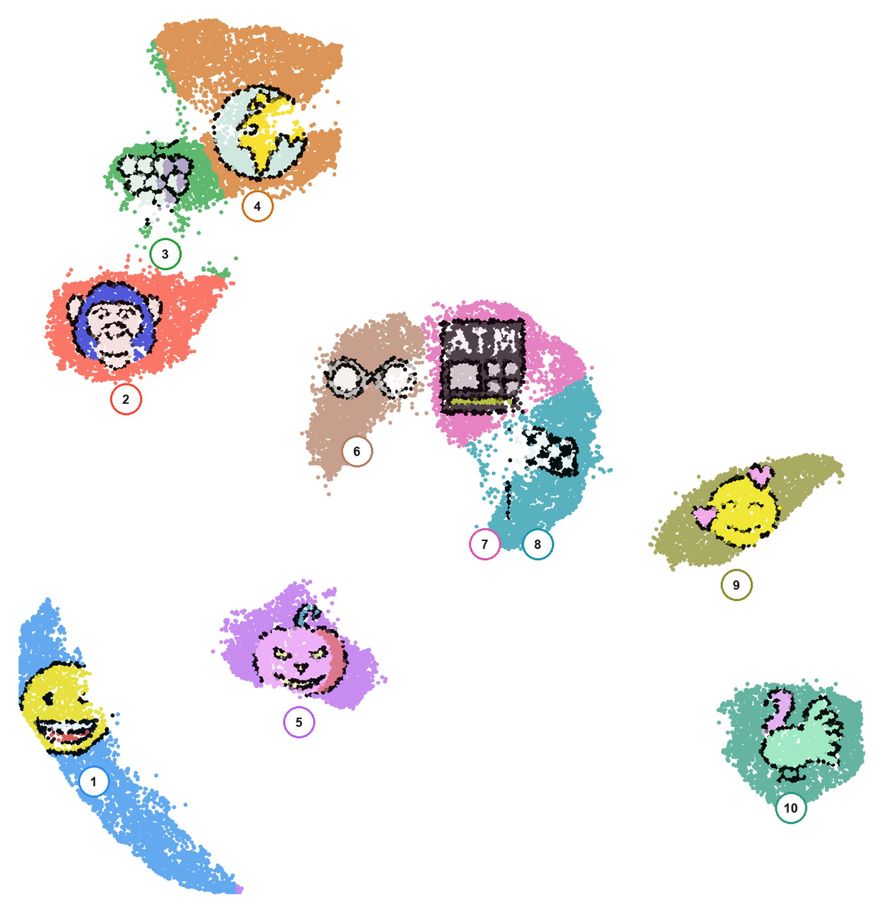

# UMAP Photo Mosaic

Turn any 2-D embedding into a mosaic of images made out of its own points.



Give it a CSV with two coordinate columns and a folder of pictures. It finds the
places on the scatter that can hold an image, hands each one a square, and colours
every point from the image nearest it — so the pictures are made of the data rather
than pasted over it. You get one self-contained HTML file (pan, zoom, click a point)
and a print-resolution poster.

## Quick start

```bash
pip install -r requirements.txt

python scripts/fetch_example.py --dataset mnist --images-from emoji   # ~20 MB
python scripts/build_mosaic.py --embedding examples/mnist-emoji/embedding.csv \
                               --images    examples/mnist-emoji/images \
                               --out       examples/mnist-emoji/mosaic \
                               --face-size 0.14 --face-fill 0.72
python scripts/build_poster.py --regions   examples/mnist-emoji/mosaic/regions.csv \
                               --images    examples/mnist-emoji/images
```

Open `examples/mnist-emoji/mosaic/mosaic.html`. `fetch_example.py` always ends by
printing the build command that suits the map it just made.

## Nothing here is about UMAP

Nothing downstream of the fetch script knows how the coordinates were made. It is a
2-D scatter painter: `--dataset` says where the points come from, `--layout` how they
were flattened, and `--images-from` where the pictures come from. All three are
independent, and the last one is unrelated to your data by design — you have data,
and you have pictures you want the data to be made of.


Two of those are not projections of anything. The stars are a Hertzsprung–Russell
diagram — colour against brightness, the oldest scatter plot in astronomy. The
bottom row is cities at their real longitude and latitude. No algorithm, no
clusters, and the placement rules do not change: Europe and India are dense enough
to hold an image, the Pacific is not.

### Thin data: `--densify`

Real scatters are often too sparse to paint with. `--densify 3` simulates two extra
points near every real one — sampled from the scatter's own shape, with the jitter
scaled by each point's distance to its own sixth neighbour, so dense ground stays
tight and the outline holds. The world map above is unreadable without it and
legible with it.

The added points are **not data**. They are flagged in a `simulated` column, left
blank in every other field, and nothing should be measured from them.

| `--images-from` | | |
|---|---|---|
| `emoji` | One from each Unicode group, via OpenMoji | Ships its own alpha, and its real names reach the legend. |
| `faces` | AI-generated portraits from SFHQ | **The one that gets cut out** — GrabCut against a head-and-shoulders trimap. Synthetic on purpose: a generated face is nobody. |
| `cartoon` | Avatars from Google's Cartoon Set | Ships its own alpha. |
| `anime` | Anime portraits | No alpha to be had, and GrabCut takes the face and throws the hair away, so these are feathered instead. |

`--dataset` takes `mnist`, `fashion`, `kmnist`, `cartoon`, `lfw`, `digits`,
`olivetti`, and the three that need no layout at all — `cities`, `stars` and
`quakes`. `--layout` takes `umap` (default), `tsne` and `pca`. Leave `--images-from`
off and each dataset illustrates itself, one image per class.

## Your own data

Two coordinate columns is the only requirement. Everything else is optional:

```csv
id,x,y,label,score
cell-0,3.71,-8.20,neuron,0.94
```

Coordinates are guessed from the usual names (`x`/`y`, `UMAP1`/`UMAP2`, `tsne_1`,
`PC1`, …); any other column is carried through and shown when you click a point.
Nothing checks, or cares, whether an algorithm produced them.
Pictures come from a folder, one per region, matched through an `image_map.csv`
you can edit and rebuild from.

## More

**[docs/GUIDE.md](docs/GUIDE.md)** covers the rest: how placement decides where each
image goes and which knobs to turn when it looks wrong, the two drawing styles, the
in-page controls, the colour system, cutting your own photographs out, and the
project layout. There is a runnable version in
[notebooks/walkthrough.ipynb](notebooks/walkthrough.ipynb).

## License

MIT. No datasets are redistributed here — everything is fetched at run time, and
`examples/` is ignored by git. Provenance for each source is in
[the guide](docs/GUIDE.md#credits).

If you publish a mosaic built from photographs of identifiable people, get their
consent first. That is why the bundled portrait example is synthetic.
