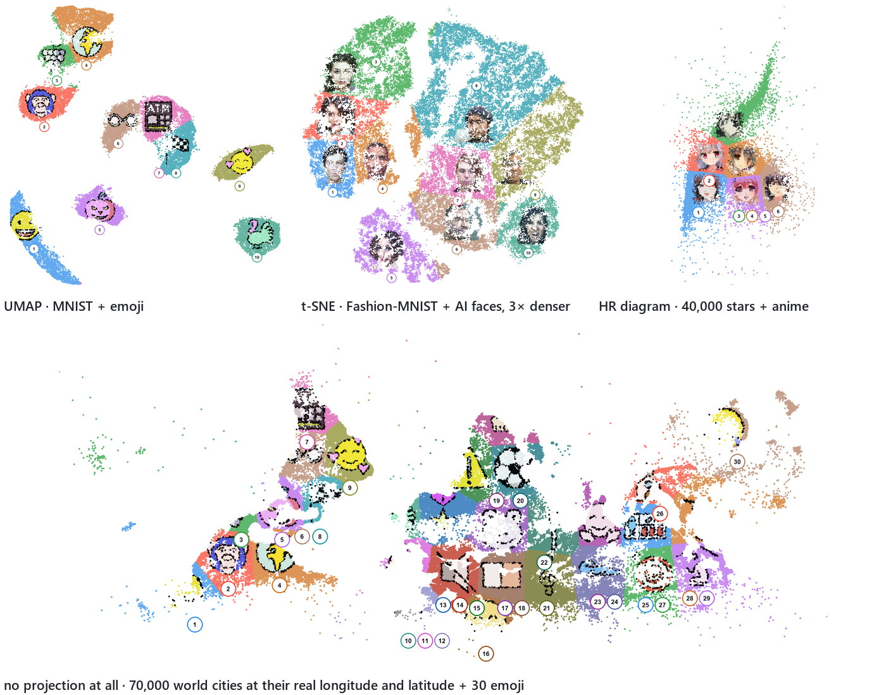

# Scatter Mosaic

Paint pictures out of the points of a scatter plot.


Give it a CSV with two coordinate columns and a folder of images. It finds the parts
of the scatter dense enough to hold a picture, gives each image a square, and then
colours every point from the image nearest it. Nothing is drawn on top: the picture
is made of the data, and every dot, wisp and gap survives.

You get one self-contained HTML file — pan, zoom, click a point to see its values —
and a poster at print resolution.

## Install and run

```bash
pip install -r requirements.txt
```

Point it at your own data:

```bash
python scripts/build_mosaic.py --embedding your_data.csv --images your_pictures/ --out mosaic
python scripts/build_poster.py --regions mosaic/regions.csv --images your_pictures/
```

Or build one of the bundled examples end to end, data and all:

```bash
python scripts/fetch_example.py --dataset mnist --images-from emoji
```

Every fetch prints the exact build command that suits the map it just made.

## Your data

Two coordinate columns is the only requirement:

```csv
id,x,y,label,score
cell-0,3.71,-8.20,neuron,0.94
```

- **Coordinates** are guessed from the usual names — `x`/`y`, `UMAP1`/`UMAP2`,
  `tsne_1`, `PC1`, `dim1` — or named with `--x-column` / `--y-column`. It does not
  matter what produced them, or whether anything did.
- **Every other column** rides along and appears when you click a point.
- **Pictures** come from a folder, one per region. The assignment is written to
  `image_map.csv`; edit it and rebuild to move a picture somewhere else.
- **Sparse data** can be thickened with `--densify 3`, which simulates points from
  the shape the scatter already has. Simulated points are flagged and are not data.

## What it looks like on different data



The bundled examples exist to be copied from. Pick where the points come from, how
they are laid out, and what the pictures are — the three are independent:

| | |
|---|---|
| **`--dataset`** | `mnist`, `fashion`, `kmnist`, `cartoon`, `lfw`, `digits`, `olivetti` — or `cities`, `stars` and `quakes`, which have real coordinates and need no layout at all. |
| **`--layout`** | `umap` (default), `tsne`, `pca`. |
| **`--images-from`** | `emoji`, `faces`, `cartoon`, `anime`. Leave it off and each dataset illustrates itself, one image per class. |

Photographs of people need their backgrounds removed first, or the picture gets
painted onto the wall behind the subject. `scripts/extract_faces.py` does that with
GrabCut, and `--images-from faces` shows it working on synthetic portraits.

## Two ways to draw it

**Painted dots** colours each point from the image, so the picture is made of the
scatter. **Image overlay** lays the picture over the dots instead. Both live inside
the page, along with a light/dark switch, an image-amount slider and a dot-size
slider — so you choose after building, not before.

## More

**[docs/GUIDE.md](docs/GUIDE.md)** — how placement decides where a picture goes and
what to change when it looks wrong, the colour system, cutting photographs out,
densifying thin data, and the limits.
**[notebooks/walkthrough.ipynb](notebooks/walkthrough.ipynb)** does the same thing
one cell at a time.

## License

MIT. No datasets are redistributed here; the examples fetch what they need at run
time and `examples/` is ignored by git. Sources and their licences are listed
[in the guide](docs/GUIDE.md#credits).

If you build a mosaic from photographs of identifiable people, get their consent
before publishing it. The bundled portrait example uses generated faces for exactly
this reason.
